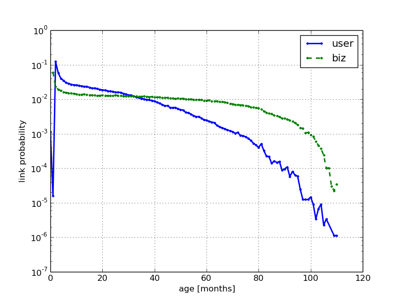

Degree Distribution
===================

The degree distribution follows a power law distribution, typical of social networks

Diameter Evolution
==================

The diameter of the graph quickly reaches a steady value of 12

Nodes Evolution
===============

Densification Coefficient
=========================

Contrary to what the theory tells us log(E(t))/log(N(t)) is not constant for this graph.
One possible explanation is because there are several cities summarized in the graph and 
they might have different node evolution rates dN(t)/dt and different densification
exponents.
As we can see from the state specific plots, the densification exponents do vary by state.
Also except for Edinburgh, the densification exponent is not constant and continues to increase.
Explanation : the other cities are American cities, reviewed by people with different user behaviors
as they might come from different cities. Whereas we can assume that the population that reviews
places in Edinburgh is quite homogenous.

[TODO: from simple simulations it seems that the curve we get is correctly explained by assuming that
E(t) is a sum of E_i(t) with different densification exponents. Get analytical form when assuming that
densification exponents are drawn for uniform or gaussian distribution]

User vs business arrival rate
=============================

Users join the graph at a higher rate than the businesses. From this we can get the probability that a given new node, belongs to the users of businesses sets.

Probability of edge linking to degree d
=======================================

Users tend to follow the same law when reviewing. But review creation tends to come from users will smaller and smaller amount of reviews.

Probability of an edge linking to a node of age a
=================================================

Unintuitively, most reviews are made by users that joined a few months ago to businesses that also joined a few months ago.
There is a significant drop for in link creation probability for old businesses this can be due to several reasons
* older businesses have a higher chance of being closed
* these businesses also might also atract users that review them less
* maybe after a certain number of reviews for a business, users simply don't review them anymore. 
[TODO  verify this assumption by looking ant edge linking probability as a function of degree node for users & businesses]

