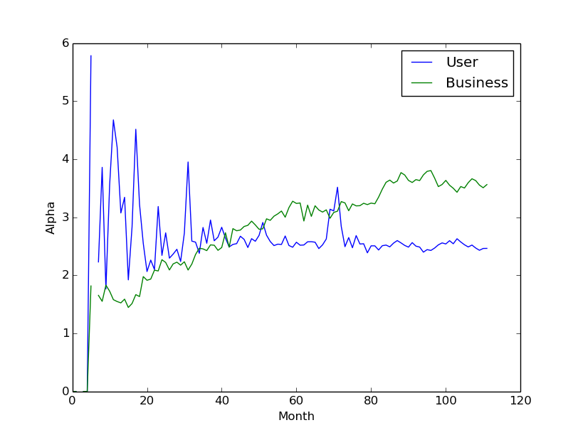

Degree Distribution
===================

The degree distribution follows a power law distribution, typical of social networks

Diameter Evolution
==================

The diameter of the graph quickly reaches a steady value of 12

Nodes Evolution
===============

Densification Coefficient
=========================

Contrary to what the theory tells us log(E(t))/log(N(t)) is not constant for this graph.
One possible explanation is because there are several cities summarized in the graph and 
they might have different node evolution rates dN(t)/dt and different densification
exponents. 
[TODO] Investigate this further.

User vs business arrival rate
=============================

Users join the graph at a higher rate than the businesses.

From this we can get the probability that a given new node, belongs to the users of businesses sets.

Probability of edge linking to degree d
=======================================

Users join the graph at a higher rate than the businesses.

Users tend to follow the same law when reviewing. But review creation tends to come from users will smaller and smaller amount of reviews.
